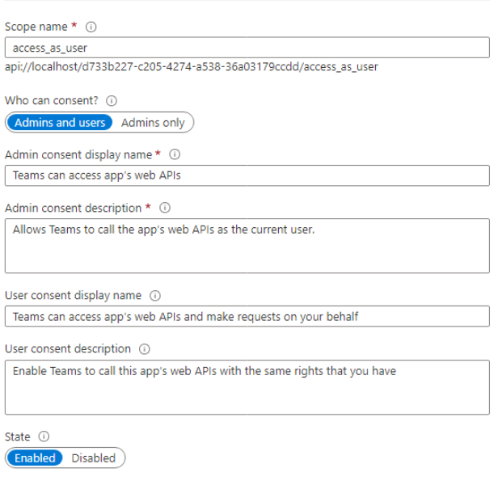

# Provision Converge in your tenant

Converge is written as a single tenant line of business application for Teams. The following steps are required to build, deploy, and install Converge in Teams on your tenant. These steps require involvement by an Azure Active Directory administrator who has the ability to grant approval to Graph and SharePoint scopes permissions, someone with experience building web applications in .NET and JavaScript, someone with experience deploying web applications to Azure, and a Teams administrator for your organization.

## Setup Azure Active Directory application registrations
* _Estimated at 2 hours of work_
* _This step requires an AAD account with the application administrator, application developer, or cloud application administrator roles_

Converge requires two kinds of AAD application registrations. 

First - we have provided a script that provisions a SharePoint list which is used by Converge to store and augment information related to workspaces and conference rooms in your tenant.

### Create the SharePoint list creation application registration
* In the Azure Portal, go to Azure Active Directory -> App Registrations -> New registration 
* Set up a single tenant registration with a name of your choosing. 
* Go to “API permissions” -> “Add a permission” -> “SharePoint” and add the `Sites.FullControl.All` application permission.
* Once the permissions are added, click “Grant admin consent for {your tenant}".
* This registration is used once to create the necessary SharePoint list for Converge. After this site is created, this registration can be deleted.

Second - the Converge Teams application requires permission to access data stored in [Microsoft Graph](https://docs.microsoft.com/en-us/graph/overview) both on behalf of the logged in user and as an application. A new registration must be created for each environment in which the Converge application is run. We recommend registrations for local development, a test deployment for administrators, and a production deployment for your entire organization.

### Create the Converge Teams application registration
* In the Azure Portal, go to Azure Active Directory -> App Registrations -> New registration 
* Set up a single tenant registration with a name of your choosing. We recommend "Converge-Local" for local development.
* The web redirect URI will need to point to the URL where you intend to host the Teams application. For local development, use `https://localhost`.
* After creating the registration, go to the Authentication tab, and select “Access tokens (used for implicit flows)”. Be sure to save this change.

### Enable single sign on in Teams
* Go to “Expose an API” and set the Application ID URI to look like “api://localhost/your_application_id” and save. 
* Click “Add a scope” and add a scope called “access_as_user” 
* Choose "Admins and users" under "Who can consent?"
* Under Admin consent display name list "Teams can access app's web APIs"
* Under Admin consent description list "Allows Teams to call the app's web APIs as the current user"
* Under User consent display name list "Teams can access app's web APIs and make requests on your behalf"
* User User consent description list "Enable Teams to call this apps web APIs with the same rights that you have"
* Click “Add a client application”. You need to add two applications and give them both access to the scope you just created. 
    * 5e3ce6c0-2b1f-4285-8d4b-75ee78787346 
    * 1fec8e78-bce4-4aaf-ab1b-5451cc387264 

### Enable relevant Graph permissions
* Go to “API permissions” -> “Add a permission” -> “Microsoft Graph” and add the permissions from the below table.
* Once the permissions are added, click “Grant admin consent for {your tenant}"

| API / Permissions name | Type | Description |
| ---- | ---- | ---- |
| Calendars.ReadWrite | Delegated | Have full access to user calendars |
| Calendars.ReadWrite | Application |Read and write calendars in all mailboxes |
| Files.Read.All | Application | Read files in all site collections |
| MailboxSettings.Read | Application | Read all user mailbox settings |
| MailboxSettings.ReadWrite | Delegated | Read and write user mailbox settings |
| MailboxSettings.ReadWrite | Application | Read and write all user mailbox settings |
| People.Read | Delegated | Read users' relevant people lists |
| Place.Read.All | Delegated | Read all company places |
| Place.Read.All | Application | Read all company places |
| Presence.Read | Delegated | Read user's presence information |
| Presence.Read.All | Delegated | Read presence information of all users in your organization |
| Sites.Manage.All | Application | Create, edit, and delete items and lists in all site collections |
| Sites.ReadWrite.All | Application | Read and write items in all site collections |
| TeamsAppInstallation.ReadForUser.All | Application | Read installed Teams apps for all users |
| User.Read | Delegated | Sign in and read user profile |
| User.Read.All | Delegated | Read all users' full profiles |
| User.Read.All | Application | Read all users' full profiles |
| User.ReadWrite | Delegated | Read and write access to user profile |
| User.ReadWrite.All | Application | Read and write all users' full profiles | 

### Repeat as needed

The above steps will need to be repeated for as many environments as you intend to support. We recommend separate registrations for local development, testing, and a production application.

## Generating the backing data store for Converge
* _Estimated at 1 hour of work, with additional time as needed to upload photos of places_
* _This step requires an AAD account with the application administrator, application developer, or cloud application administrator roles_

Converge relies on creating a copy of your workspace and conference room data from Exchange in SharePoint. SharePoint facilitates your ability to clean up old data for Converge by unchecking the "isAvailable" box in the SharePoint list you generate for any old conference rooms or workspaces. We also create a SharePoint document list to store photos related to your workspaces and conference rooms so these can be surfaced in Converge and managed by a person of your choosing. 

Before you provision Converge for the first time, you will need to generate these SharePoint lists on a SharePoint site of your choosing. Do the following:

* Make a new AAD registration just for creating these SharePoint lists, as documented above.
* Create a self-singed cert with a password using `CreateSelfSignedCertificate.ps1`
* Upload the certificate to the app registration in AAD created for this purpose and keep the private key in a location you can access.
* Run `$CertPassword = ConvertTo-SecureString -AsPlainText "your cert password" -Force`
* Run `.\GenerateSharePointLists.ps1 -PathToPrivateKey .\YourKey.pfx -ClientID id_of_aad_app -CertPassword $CertPassword -SharePointURL https://tenantName.sharepoint.com/{your-site} -Tenant tenantName.onmicrosoft.com`
* If you have provided the PlaceListName and PlacePhotosListName values, make note of these values for later use. Otherwise, use the default values of `Converge_Places` and `Converge_Places_Photos`.
* The first time you run Converge, the application will populate this list with your data from Exchange, and augment the data with latitude and longitude if any address for the spaces is provided in Exchange.
* Photos of workspaces and conference rooms can be uploaded to the `Converge_Places_Photos` list and associated with the correct room by a person of your choosing. If photos do not exist, Converge will display a placeholder.

## Setting up local development
* _Estimated at 4 hours of work_
* _This step requires access to create a client secret on the AAD registration created for local development, and the ability to sideload a local application in Teams._

First, clone this repository onto your local machine. 

To run the client side application locally, go to `/ClientApp/README.md` and follow the instructions there.

To run the server locally:
* Open your the AAD app registration created for local development in the Azure portal.
* Go to 'Certificates & secrets'
* Generate a new client secret and copy its value to the clipboard
* Open the Converge project in Visual Studio
* Right click on the project and choose `Manage User Secrets`.
* Fill your [user secrets](https://docs.microsoft.com/en-us/aspnet/core/security/app-secrets?view=aspnetcore-6.0&tabs=windows#manage-user-secrets-with-visual-studio) with [configuration variables](./config_variables.md), including the client secret, and other data from AAD.
* Setup a Bing Maps Developer API key [per these instructions](https://docs.microsoft.com/en-us/bingmaps/getting-started/bing-maps-dev-center-help/getting-a-bing-maps-key), and add it to the user secrets file.
* Setup a Yelp API Key [per these instructions](https://www.yelp.com/developers/documentation/v3/authentication), and add it to the user secrets file.
* You should now be able to run the project in Visual studio by pressing play.
* Download the `appPackage.zip` file from `https://localhost:3000/appPackage.zip`.
* [Sideload the app into Teams](https://docs.microsoft.com/en-us/microsoftteams/platform/concepts/deploy-and-publish/apps-upload)
* You should now be able to test your local development of Converge on Teams.

## Generating Azure resources for test and production deployments
* _Estimated at 4 hours of work_
* _This step requires access to provision resources under a subscription in Azure._

Instructions on how to generate the appropriate Azure resources for deployment can be found under [azure-templates](./azure-templates.md).

## Build and deploy from Azure DevOps
* _Estimated at 2 hours of work_
* _This step requires access to a subscription in Azure._
* _This step requries access to create build pipelines in Azure DevOps._

Instructions on how to create a build pipeline for Converge from Azure DevOps can be found uner [pipeline](./pipeline.md).

## Install on Teams
* _Estimated at 2 hours of work_
* _This step requires Teams administrator access_

The following instructions will make Converge available in the app store under "Built for your organization".

### Install the custom app
* Go to https://your-converge-hostname/appPackage.zip. This will download a zip file that contains the app manifest for Converge. 
* Go to the Teams Admin Center -> Teams apps -> Manage apps 
* Click “Upload”
* In the dialog that appears, click “Select a file” and choose the zip file downloaded in the first step.
* Your app is now available in the app store for your organization. It may take some time to populate to your entire tenant.

**Note:** You may wish to create an app setup policy for your test deployment of Converge so it is only available to select individuals and not visible to all users through the app store.

## Create a secrets rotation reminder
We recommend that secret values are rotated every 3 months. The following instructions will send a reminder email to ensure this policy is followed.

* Log into Power Automate.
* Click on create on left menu.
* Search “Get an email reminder”.
* Select a template with a name “Get an email reminder”.
* Log into “Office 365 users” Get an email reminder | Microsoft Power Automate.
* Click on continue.
* Select a recurrence.
* Provide a value interval and frequency for email trigger.
* In email template and provide a email address, Subject and Body.
* Click on Save.
* Click on test.
* Select a “automatically” and Close a popup.

