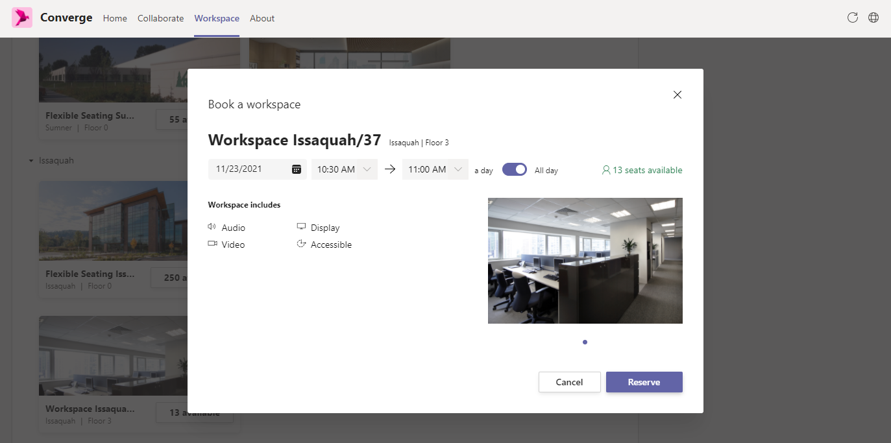

# Converge
    

## What is Converge?
Converge is a [JavaScript app](https://docs.microsoft.com/en-us/javascript/api/overview/msteams-client?view=msteams-client-js-latest) for [Microsoft Teams](https://www.microsoft.com/en-us/microsoft-teams/group-chat-software) that utilizes [Microsoft Graph](https://developer.microsoft.com/en-us/graph), [Bing Maps](https://www.microsoft.com/en-us/maps/choose-your-bing-maps-api) and [Yelp Fusion](https://fusion.yelp.com/) to find workspaces, meeting rooms, and local venues that are convenient for you and your colleages. 

## What is our goal?
As the pandemic moves more people to a hybrid work environment, it's become increasingly difficult for people to maintain relationships and get work done. Our goal with Converge is to increase in-person collaboration by providing the tools to discover convenient opportinuties to meet in person.

## Features:
- Check who will be in the office on a given date.
- Check the availability of workspaces.
- Book workspaces and meeting rooms.
- Quickly arrange meetings with colleagues during times they are available.
- Visualize distance between meeting locations and your colleages.
- Locate venues and workspaces that are conveniently located for meeting members.
- Comprehensive filtering for buildings and meeting rooms.

## The technologies we are using
Converge uses [Node js](https://nodejs.dev/) to build a Teams extension manifest. The app itself uses a [React.js](https://reactjs.org/) application with a [.Net Core](https://dotnet.microsoft.com/download/dotnet) backend. This repository includes ARM templates to provision resources in Azure that provide hosting, monitoring, and secure secret storage. 

## Contributing
For instructions on how to contribute, please read ```./CONTRIBUTING.md```

## Trademarks
This project may contain trademarks or logos for projects, products, or services. Authorized use of Microsoft trademarks or logos is subject to and must follow [Microsoft’s Trademark & Brand Guidelines](https://www.microsoft.com/en-us/legal/intellectualproperty/trademarks/usage/general). Use of Microsoft trademarks or logos in modified versions of this project must not cause confusion or imply Microsoft sponsorship. Any use of third-party trademarks or logos are subject to those third-party’s policies.

## Build and deploy Converge

To build and deploy Converge for your organization, follow the instructions found in `DEV.md`.


## Maximum Number of users/transactions that could be supported.
Bing Maps Developer License - As per Bing Maps Developer License, the statistics are provided in terms of number of transactions. 
							  There can be upto 125,000 cumulative billable transactions for Website/Mobile-Apps/Development/Testing, whereas, 
							  upto 50,000 cumulative billable transactions for Windows-App/Education/Non-profit. Check for more details: https://www.microsoft.com/en-us/maps/licensing/.
							  Considering 125,000 transactions, total number of users, supported on an average, is 816 per day.

Yelp API Developer License -  As per documentation from Yelp Developer License, it can support upto 5,000 calls per day. Any call made after that in the same day will get back a response 
							  with status code 429 (Too Many Requests). Daily limits are reset every midnight UTC time. Check for more details: https://www.yelp.com/developers/faq.
							  Considering 5,000 API calls, total number of users, supported on an average, is 1078 per day.

Background Jobs for Location prediction - A good configured server (with configuration like 32/64 Gigs of RAM, and 11/12th Generation's Intel i7 core processor or equivalent) would process 
										  around minimum of 50K-60K users (who have calendar events) within 24 hours' job-execution-window (considering 1.5 seconds on an average per user). 
										  And it may go maximum upto 100K users.

Graph Throttling Limitation - Based on single user statistics, and pro-rata based calculation, the number of users that can be supported = 5859 users simultaneously.

