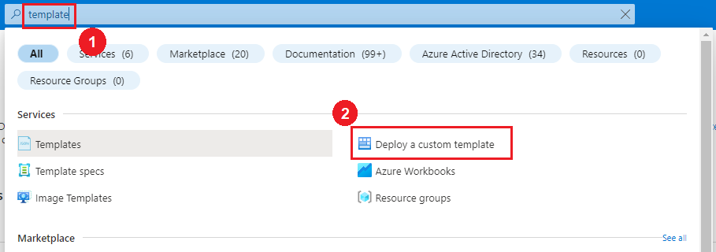
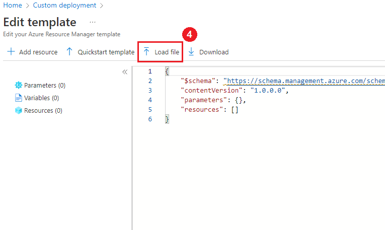
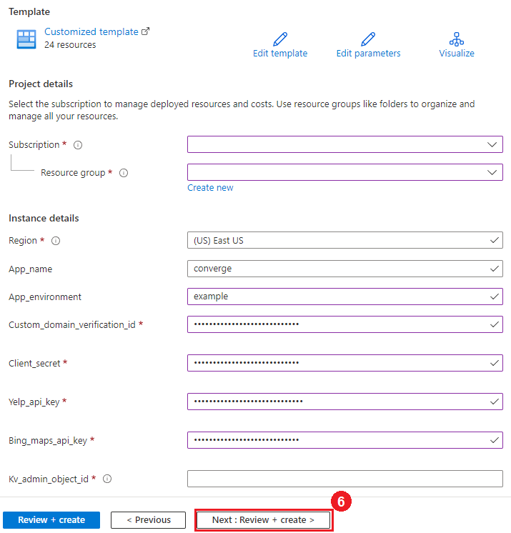
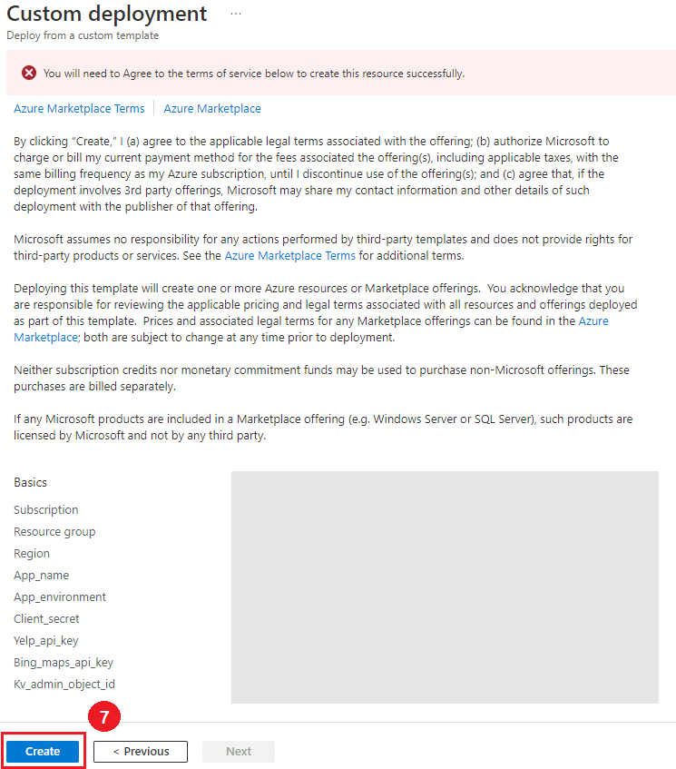
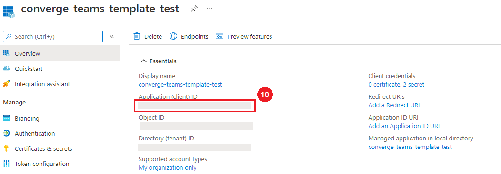
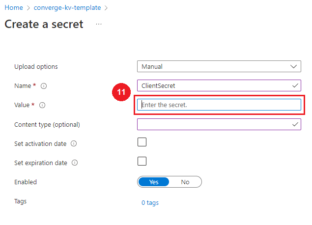

# Azure Templates
Converge makes use of multiple cloud based resources that are hosted on the [Azure Cloud Platform](https://azure.microsoft.com/en-us/free/search/?OCID=AID2200277_SEM_8b79b587ec8b149f2342d4446dc6d79d:G:s&ef_id=8b79b587ec8b149f2342d4446dc6d79d:G:s&msclkid=8b79b587ec8b149f2342d4446dc6d79d). In order to create your own instance of Converge, you will need to setup an the following Azure resources:

- Workspace
- App Insights
- App Service Plan
- App Service
- Key Vault

To simplify this process, multiple [Azure Resource Manager (ARM) templates](https://docs.microsoft.com/en-us/azure/azure-resource-manager/templates/overview) are available in the `./arm-templates` folder. You can use `./arm-templates/azure-template.json` alone to create your azure resources.

## Deploy an Azure template
To deploy a template, log into [Azure portal](https://portal.azure.com) and perform the following steps:

1. Enter "template" into the searchbar.
2. Select "Deploy a custom template" from the results that showup.

3. Select "Build your own template in the editor"

4. Press load file and select the template you want to deploy from the `./arm-template` folder.

5. Press the save button.

6. Start by selecting the subscription, resource group and region you want to use. Next fill out the following parameters:
    - App_name: used to name the generated resources.
    - App_environment: adds a suffix to the resources name to differentiate between environments.
    - Yelp_api_key: API key used by application. More info can be found in Converge's [DEV](./DEV.md) page under Local Development.
    - Bing_maps_api_key: API key used by application. More info can be found in Converge's [DEV](./DEV.md) page under Local Development.
    - Kv_admin_object_id: [objectId](https://docs.microsoft.com/en-us/azure/marketplace/find-tenant-object-id#find-user-object-id) of the the user that will be given permissions to access the keys in the key vault.

7. Once validation completes, press create to begin the deployment.

8. At this point, the deployment should be complete without errors.

9. Locate the Client (application) ID of the app registration created in AAD to support this deployment of Converge and enter it into the template.

10. Create a new Client secret in the AAD registration that was created to support this deployment of Converge. Place that secret in the Converge key vault that was created with a key of "ClientSecret" and a value that is your secret. Within that AAD registration, change the Application ID URI and redirect URLs to reflect the URL that was created in the App service that was deployed using the Azure template.

11. Add key vault references in your configuration settings in the app service for each key vault value.
  - The key for `ClientSecret` should be `AzureAD:ClientSecret`
  - The value of each configuration setting should be `@Microsoft.KeyVault(SecretUri=https://{uri of key vault here}/secrets/{name of secret})`

11. Repeat these steps for as many environments as you need to create for Converge. We recommend a test and a production deployment.