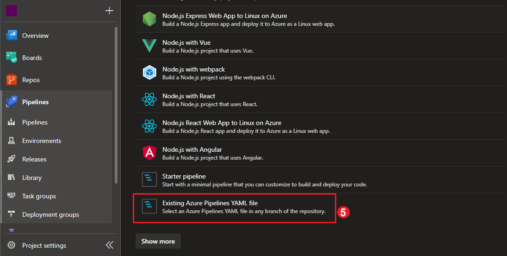

# Pipeline setup

1. [Create a service connection](https://docs.microsoft.com/en-us/azure/devops/pipelines/library/service-endpoints?view=azure-devops&tabs=yaml) in Azure DevOps that links to the subscription of the web app that you've created in Azure.
1. Open the Azure Devops Pipelines page for your project.
2. Select new Pipeline
3. Select the a location for your code repository.
4. Select the repository where the Converge App source code is located.

5. Select the "Existing Azure Pipelines YAML file" option
6. Select the branch you want to have deployed by your pipeline.
7. ensure that /azure-pipelines.yml is selected in the path dropdown.
8. Select the continue button.
9. On the "Review Your pipeline YAML" page, select the "Variables" button on the top right and enter them according to the comment at the top of the YAML code.
10. Once all your variables have been added, select the chevron to the right of the "Run" button and select save from the dropdown menu.
11. Your pipeline should be complete and ready to run.
12. You will need as many pipelines as the deployments you intend to create. We recommend a test deployment pipeline that runs on every merge to main, and a production pipeline that is run manually after changes have been tested in the test deployment.
